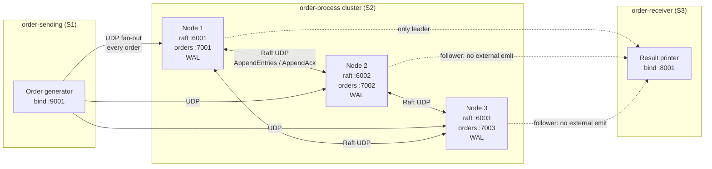

# Rust OMS Demo (S1 -> S2 Cluster -> S3)

This project demonstrates a microservice-style order flow with:

- `S1` (`order-sending`) generating and publishing orders
- `S2` (`order-process`) as a 3-replica Raft-style processing cluster
- `S3` (`order-receiver`) receiving final results

`order-process` uses:

- leader election (term-based)
- log replication (`AppendEntries`/`AppendAck`)
- quorum commit
- per-node durable WAL on disk

Only the current leader sends final results to `S3`.

---

## Architecture



**Roles**

| Service | Machines (example) | Responsibility |
|---|---|---|
| `order-sending` | Yousuf | Creates orders every 1s; sends to all S2 order ports |
| `order-process` | Vivek, Amit, Nitin | Leader election, replicated WAL, quorum commit, apply |
| `order-receiver` | Yousuf | Prints final committed results from the leader |

**Leader path:** S1 → all S2 order ports → leader proposes to WAL → replicate to followers → quorum commit → leader sends result to S3.

**Failover:** If the leader stops, remaining nodes elect a new leader (higher term); the new leader continues sending to S3.

---

## Project Structure

Each service is fully independent (own `Cargo.toml`, own `target`):

| Folder | Service | Role |
|---|---|---|
| `order-sending/` | S1 | Generates and sends orders to all S2 replicas |
| `order-process/` | S2 | 3-node replicated processing cluster |
| `order-receiver/` | S3 | Receives committed final results |

Service-specific configs:

- `order-sending/src/config.rs`
- `order-process/src/config.rs`
- `order-receiver/src/config.rs`

---

## Message Flow

1. `order-sending` creates one order every second.
2. S1 fan-outs the same order to all S2 order ports.
3. S2 leader proposes a replicated command into WAL.
4. Leader replicates to followers.
5. After quorum ack, leader marks entry committed.
6. All S2 nodes apply committed entries in order.
7. Leader publishes final result to S3 receiver.

Follower nodes do not emit external results.

---

## Ports and Channels

| Purpose | Node/Service | Port |
|---|---|---|
| Raft control | S2-1 | `6001` |
| Raft control | S2-2 | `6002` |
| Raft control | S2-3 | `6003` |
| Order ingress | S2-1 | `7001` |
| Order ingress | S2-2 | `7002` |
| Order ingress | S2-3 | `7003` |
| Sender bind | S1 | `9001` |
| Receiver bind | S3 | `8001` |

---

## Config (.env)

`order-process` loads cluster IPs/ports from `order-process/.env` (via `dotenvy` and `starter.sh`).

| File | Use case |
|---|---|
| `.env.example` | **One computer** — all nodes on `127.0.0.1` (local dev) |
| `cluster.sample` | **Multi-machine** — real IPs for Vivek / Amit / Nitin / Yousuf |
| `.env` | Active config on each machine (copy from example or sample) |

**Local single-machine setup**

```bash
cd order-process
cp .env.example .env
```

**Multi-machine cluster**

```bash
cd order-process
cp cluster.sample .env
# edit IPs if needed
```

Use the **same `.env` content** on all three `order-process` machines. On each machine run `./starter.sh` — `NODE_ID` is auto-detected from that machine’s IP vs `NODE1/2/3_HOST`. Override with `./starter.sh 1` (needed when all hosts are `127.0.0.1`).

---

Default cluster IPs (see `order-process/cluster.sample` or `.env`):

| Machine | Role | IP |
|---|---|---|
| Vivek | S2 node 1 | `172.16.12.104` |
| Amit | S2 node 2 | `172.16.13.181` |
| Nitin | S2 node 3 | `10.10.1.121` |
| Yousuf | order-receiver (S3) | `10.10.1.69` |

### 1) Build each service

```bash
cd order-process && cargo build --release
cd ../order-sending && cargo build --release
cd ../order-receiver && cargo build --release
```

### 2) Run services (5 terminals)

```bash
# Terminal 1–3 (multi-machine: just ./starter.sh on each host)
cd order-process
./starter.sh          # auto NODE_ID from IP
# or: ./starter.sh 1  # force id (local 127.0.0.1 demo)

# Terminal 4
cd order-receiver
./target/release/order-receiver

# Terminal 5
cd order-sending
./target/release/order-sending
```

You should see:

- one S2 node becomes leader
- sender emits orders
- receiver prints final results

---

## Multi-Machine Setup

If running on Vivek/Amit/Nitin/Yousuf style deployment:

1. Update IPs in:
   - `order-process/src/config.rs`
   - `order-sending/src/config.rs`
   - `order-receiver/src/config.rs`
2. Build on each machine (or copy binaries).
3. Ensure firewall/network allows all required ports.
4. Start:
   - `order-process` on 3 machines with `NODE_ID=1/2/3`
   - `order-receiver` on receiver machine
   - `order-sending` on sender machine

Important:

- Do not use `127.0.0.1` for cross-machine nodes.
- Do not use Docker bridge IPs (`172.17.x.x`, `172.18.x.x`, etc.).

---

## WAL / Persistence

`order-process` stores per-node WAL under:

- default: `order-process/data/wal-s2-<node_id>.log`
- override: set `ORDER_PROCESS_DATA_DIR` env var

Example:

```bash
ORDER_PROCESS_DATA_DIR=/var/lib/order-process NODE_ID=1 ./target/release/order-process
```

---

## Failover Test (Leader Election Validation)

1. Start all services and wait until one S2 node is leader.
2. While traffic is flowing, kill leader process.
3. Observe:
   - another S2 node becomes leader (higher term)
   - receiver continues getting results
   - followers continue applying replicated entries

Example kill command:

```bash
pkill -f order-process
```

(Use carefully on the exact machine/process you want to stop.)

---

## Operational Notes

- Raft quorum for 3 nodes is 2.
- Leader election timeout defaults to 300-600 ms.
- This demo uses UDP and simplified processing logic.
- Business processing is placeholder logic for demonstration.

---

## Quick Troubleshooting

- `failed to bind ...`: port already in use -> stop old process or change port.
- No leader appears: verify inter-node reachability on Raft ports.
- Receiver not getting results: verify `S3_HOST`/`S3_PORT` in `order-process` config.
- Multi-network environment (LAN + Wi-Fi): ensure all S2 nodes can reach each other directly.
