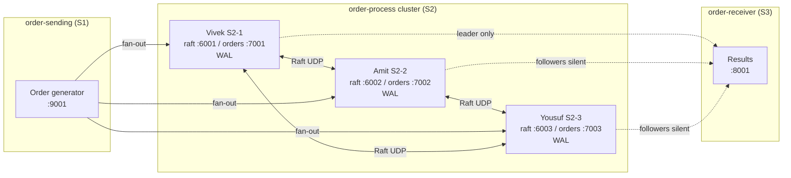

# Rust OMS Demo (S1 → S2 Cluster → S3)

Microservice-style order pipeline with a 3-node Raft-style processing cluster.

| Service | Folder | Role |
|---|---|---|
| **S1** | `order-sending/` | Creates one order per second; UDP fan-out to all S2 nodes |
| **S2** | `order-process/` | 3-replica cluster: election, WAL replication, quorum commit |
| **S3** | `order-receiver/` | Prints / logs final results from the **leader only** |

Each service is a standalone Rust crate (own `Cargo.toml`, own `target/`). **All hosts/IPs come from `.env` files — nothing is hardcoded in Rust.**

---

## Architecture



**Happy path**

1. Sender writes order → all three S2 order ports  
2. Leader appends to its WAL and replicates to followers  
3. After quorum commit, leader applies and sends result to S3  
4. Followers apply the same committed entries (same logical log)

---

## Lab machines (example)

| Machine | Name in logs | Services | Example IP |
|---|---|---|---|
| Vivek | `NODE1_NAME=Vivek` | `order-process` (node 1) | `172.16.12.104` |
| Amit | `NODE2_NAME=Amit` | `order-process` (node 2) | `172.16.13.181` |
| Yousuf | `NODE3_NAME=Yousuf` | `order-process` (node 3) + sender + receiver | `172.16.12.252` |

Use the **same** `NODE*_HOST` / ports on every machine’s `.env`. Only `NODE_ID` differs (auto-detected from local IP, or pass `./starter.sh 1|2|3`).

---

## Ports

| Purpose | Port |
|---|---|
| Raft (Vivek / Amit / Yousuf) | `6001` / `6002` / `6003` |
| Orders in (Vivek / Amit / Yousuf) | `7001` / `7002` / `7003` |
| Sender bind | `9001` |
| Receiver bind | `8001` |

Open UDP on these ports between all machines.

---

## Config (`.env` only)

No machine IPs in source code. Each service loads dotenv:

| Service | Files |
|---|---|
| `order-process` | `.env` (active), `.env.example` (localhost), `cluster.sample` (lab IPs) |
| `order-sending` | `.env`, `.env.example`, `cluster.sample` |
| `order-receiver` | `.env`, `.env.example` |

**Local (one PC, three `order-process` processes)**

```bash
cd order-process && cp .env.example .env
# use ./starter.sh 1 / 2 / 3 in three terminals
```

**Multi-machine lab**

```bash
cd order-process && cp cluster.sample .env   # same file on Vivek, Amit, Yousuf
cd ../order-sending && cp cluster.sample .env
cd ../order-receiver && cp .env.example .env
# set S3_HOST / NODE* to match your LAN
```

### Important `order-process` knobs

| Variable | Meaning | Default |
|---|---|---|
| `NODE1/2/3_NAME` | Names in `[role]` lines | Vivek / Amit / Yousuf |
| `NODE1/2/3_HOST` | Peer IPs (**required**) | — |
| `S3_HOST` / `S3_PORT` | Where leader sends results | port `8001` |
| `ALLOW_SINGLE_NODE_LEADER` | Alone node may elect + commit | `true` |
| `PEER_SILENT_MS` | Mark peer “not available” after silence | `2000` |
| `VERBOSE_RAFT` | Print Raft catch-up spam | `false` |

---

## How to run

### Build

```bash
cd order-process && cargo build --release
cd ../order-sending && cargo build --release
cd ../order-receiver && cargo build --release
```

### Multi-machine (recommended)

**On Vivek / Amit / Yousuf (order-process):**

```bash
cd order-process
./starter.sh          # NODE_ID from this machine’s IP
# or: ./starter.sh 1  # Vivek   ./starter.sh 2  # Amit   ./starter.sh 3  # Yousuf
```

`starter.sh` loads `.env`, installs Rust via rustup if needed, and runs release.

**On Yousuf (receiver + sender):**

```bash
cd order-receiver && cargo run --release
cd order-sending  && cargo run --release
```

### What you should see

**Role line (order-process):**

```text
[role] Vivek is LEADER; Amit is FOLLOWER; Yousuf is FOLLOWER
```

When peers are down:

```text
[role] Vivek is not available; Amit is not available; Yousuf is LEADER
```

**Order files (append-only):**

| File | Written by |
|---|---|
| `order-sending/logs/orders-sent.log` | every sent order |
| `order-receiver/logs/orders-received.log` | every received result |

(`**/logs/` is gitignored.)

---

## Quorum, failover, and “one machine left”

| Live S2 nodes | Quorum (with `ALLOW_SINGLE_NODE_LEADER=true`) | Behavior |
|---|---|---|
| 3 | 2 | Normal Raft majority |
| 2 | 2 | Still need both live nodes to agree |
| 1 | 1 | Remaining node becomes leader and **can commit alone** after peers silent ≥ `PEER_SILENT_MS` |

**Failover test**

1. Start all three `order-process` + receiver + sender.  
2. Note who is `LEADER` in `[role]` lines.  
3. Stop the leader process.  
4. Within ~1–2s another node should become `LEADER`; receiver keeps getting orders.  
5. Stop two nodes: the last one should show the others as `not available`, become `LEADER`, and still send results to S3 (lab single-node mode).

Strict production Raft (no single-node) → set `ALLOW_SINGLE_NODE_LEADER=false` (then 1 of 3 **cannot** elect/commit).

---

## WAL (one file per machine)

Each node keeps its own durable log (not a shared NFS file):

```text
order-process/data/wal-s2-<node_id>.log
```

Override directory: `ORDER_PROCESS_DATA_DIR=/path ./starter.sh`

Raft keeps logs logically the same via batched `AppendEntries`. If logs diverge badly:

1. Stop sender and all processors.  
2. Keep the **longest correct** WAL.  
3. On lagging nodes: `rm -f data/wal-s2-*.log` (or under your data dir).  
4. Restart all three, then sender; leader will catch followers up.

---

## Message / code flow (short)

1. **S1** JSON order → UDP to `NODE1/2/3_HOST:ORDER_PORT`  
2. **S2 leader** builds `ReplicatedCommand` → WAL → replicate → quorum commit → apply  
3. **S2 leader** UDP result → `S3_HOST:S3_PORT`  
4. **S3** prints + appends `logs/orders-received.log`  
5. **S2 followers** only replicate/apply; they do **not** emit to S3  

---

## Troubleshooting

| Symptom | Check |
|---|---|
| `missing NODE1_HOST in .env` | Copy `cluster.sample` / `.env.example` to `.env` |
| `NODE_ID` panic / auto-detect fail | Run on a machine whose IP matches `NODE*_HOST`, or `./starter.sh 1\|2\|3` |
| `failed to bind` | Port in use; stop old process |
| No `[role] … LEADER` | Raft UDP `6001–6003` blocked or wrong IPs |
| Role shows LEADER but receiver silent | Confirm `S3_HOST`/`S3_PORT`; wait until peers marked not available if testing alone |
| WAL lengths differ a lot | Catch-up / wipe lagging WALs (see above); ensure latest code |
| Cross-subnet (e.g. `10.10` vs `172.16`) | All nodes must route to each other; prefer one LAN |

---

## Operational notes

- Demo processing is random `FILLED` / `PARTIALLY_FILLED` / `REJECTED` (placeholder).  
- Transport is UDP (lab simplicity, not production messaging).  
- Default election timeout 300–600 ms; heartbeat 100 ms.  
- Set `VERBOSE_RAFT=true` only when debugging replication.
