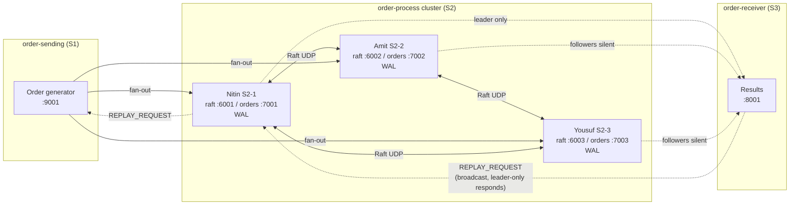

# Rust OMS Demo (S1 → S2 Cluster → S3)

Microservice-style order pipeline with a 3-node Raft-style processing cluster.

| Service | Folder | Role |
|---|---|---|
| **S1** | `order-sending/` | Rate-paced order generator (`TARGET_TPS`, default 5000); HMAC-signed, bincode-encoded Aeron unicast fan-out to all 3 S2 nodes; own WAL for restart-safe sequencing and S1<->S2 replay |
| **S2** | `order-process/` | 3-replica cluster: election, WAL replication, quorum commit; ingest-side gap detection + replay from S1; serves S2<->S3 replay when leader |
| **S3** | `order-receiver/` | Verifies + logs final results from the **leader only**; gap detection + replay requests to S2; periodic checkpoint for restart recovery |
| monitoring | `order-monitoring/` | Independent arbiter: corroborates single-node self-promotion (see below) |

Each service is a standalone Rust crate (own `Cargo.toml`, own `target/`). **All hosts/IPs come from `.env` files — nothing is hardcoded in Rust.**

**Delivery model**: at-least-once with idempotent per-hop deduplication (order_id-based) — not exactly-once. Every hop can experience redelivery via Aeron or replay; every hop dedups. See "Zero-loss: sequencing, gap detection & replay" below for the mechanism.

---

## Architecture



**Happy path**

1. Sender writes order → all three S2 order ports  
2. Leader appends to its WAL and replicates to followers  
3. After quorum commit, leader applies and sends result to S3  
4. Followers apply the same committed entries (same logical log)

**Gap path** (a node missed something — Aeron loss, backpressure skip, or a restart)

5. The node's `SequenceTracker` notices a persistent gap in `order_id` (50ms debounce, so ordinary reordering isn't mistaken for loss)  
6. It sends a HMAC-signed `REPLAY_REQUEST` on a dedicated control port (never the Aeron data stream) to whoever can serve it — order-sending for an S1<->S2 gap, or (broadcast to) the S2 cluster for an S2<->S3 gap, where only the leader responds  
7. The missing range is re-published from the sender's WAL; the requester's own tracker dedups it against what it already has

This is at-least-once delivery with idempotent dedup at every hop — not exactly-once.

---

## Lab machines (example)

| Machine | Name in logs | Services | Example IP |
|---|---|---|---|
| Nitin | `NODE1_NAME=Nitin` | `order-process` (node 1) | `172.16.12.104` |
| Amit | `NODE2_NAME=Amit` | `order-process` (node 2) | `10.10.0.56` |
| Yousuf | `NODE3_NAME=Yousuf` | `order-process` (node 3) + sender + receiver + `order-monitoring` | `10.10.1.69` |

Use the **same** `NODE*_HOST` / ports on every machine’s `.env`. Only `NODE_ID` differs (auto-detected from local IP, or pass `./starter.sh 1|2|3`).

---

## Ports

| Purpose | Port |
|---|---|
| Raft (Nitin / Amit / Yousuf) | `6001` / `6002` / `6003` |
| Orders in (Nitin / Amit / Yousuf) | `7001` / `7002` / `7003` |
| Health probe — monitoring only (Nitin / Amit / Yousuf) | `6101` / `6102` / `6103` |
| S2<->S3 replay-request (Nitin / Amit / Yousuf) | `6201` / `6202` / `6203` |
| Sender bind — also the S1<->S2 replay listener | `9001` |
| Receiver bind | `8001` |
| monitoring corroboration | `9101` (on the monitoring machine) |

Open UDP on these ports between all machines.

---

## Config (`.env` only)

No machine IPs in source code. Each service loads dotenv:

| Service | Files |
|---|---|
| `order-process` | `.env` (active), `.env.example` (localhost), `cluster.sample` (lab IPs) |
| `order-sending` | `.env`, `.env.example`, `cluster.sample` |
| `order-receiver` | `.env`, `.env.example` |
| `order-monitoring` | `.env` (active), `.env.example` (localhost) |

**Local (one PC, three `order-process` processes)**

```bash
cd order-process && cp .env.example .env
# use ./starter.sh 1 / 2 / 3 in three terminals
```

**Multi-machine lab**

```bash
cd order-process && cp cluster.sample .env   # same file on Nitin, Amit, Yousuf
cd ../order-sending && cp cluster.sample .env
cd ../order-receiver && cp .env.example .env
# set S3_HOST / NODE* to match your LAN
```

### Important `order-process` knobs

| Variable | Meaning | Default |
|---|---|---|
| `NODE1/2/3_NAME` | Names in `[role]` lines | Nitin / Amit / Yousuf |
| `NODE1/2/3_HOST` | Peer IPs (**required**) | — |
| `S3_HOST` / `S3_PORT` | Where leader sends results | port `8001` |
| `S1_HOST` / `S1_REPLAY_PORT` | **Required** — where order-sending's replay listener is, for S1<->S2 REPLAY_REQUEST | — / `9001` |
| `NODE1/2/3_REPLAY_PORT` | S2<->S3 replay-request ports (order-receiver broadcasts here) | 6201 / 6202 / 6203 |
| `ALLOW_SINGLE_NODE_LEADER` | Alone node may elect + commit | `true` |
| `PEER_SILENT_MS` | Mark peer “not available” after silence | `2000` |
| `VERBOSE_RAFT` | Print Raft catch-up spam | `false` |
| `monitoring_HOST` / `monitoring_PORT` | Independent arbiter consulted before single-node self-promotion | — (unset = no monitoring) |
| `REQUIRE_monitoring_FOR_SINGLE_NODE_LEADER` | `false` = legacy blind-timeout self-promotion (no monitoring needed). **Casing is exact** (`monitoring`, not `MONITORING`) — a leftover of the order-witness→order-monitoring rename; get it wrong and this silently reads as unset (defaults to `true`) | `true` |
| `NODE1/2/3_HEALTH_PORT` | Liveness-probe port the monitoring pings (separate from Raft) | 6101 / 6102 / 6103 |

`order-receiver` now also requires `CLUSTER_HMAC_KEY` (it verifies the result channel's HMAC and signs its own replay requests) and a full S2 node list (`NODE1/2/3_HOST` + `NODE1/2/3_REPLAY_PORT`) to broadcast `REPLAY_REQUEST` — it used to need almost no config.

---

## How to run

### Build

```bash
cd order-process && cargo build --release
cd ../order-sending && cargo build --release
cd ../order-receiver && cargo build --release
cd ../order-monitoring && cargo build --release
```

### Multi-machine (recommended)

**On Nitin / Amit / Yousuf (order-process):**

```bash
cd order-process
./starter.sh          # NODE_ID from this machine’s IP
# or: ./starter.sh 1  # Nitin   ./starter.sh 2  # Amit   ./starter.sh 3  # Yousuf
```

`starter.sh` loads `.env`, installs Rust via rustup if needed, and runs release.

### Benchmarking

```bash
# Run 1-node baseline benchmark (1 node, 4 threads, 10s duration, 5000 TPS target)
./scripts/run_benchmark.sh 1 4 10

# Run 3-node Raft consensus benchmark (3 nodes, 8 threads, 10s duration)
./scripts/run_benchmark.sh 3 8 10

# Full args: nodes threads duration_sec target_tps
./scripts/run_benchmark.sh 1 16 30 40000
```

**Measured, not claimed**: on a single shared machine simulating all 3 S2 nodes + sender + receiver, this environment sustains roughly **~20,000 orders/sec with 1 node** and **~7,000-8,000 orders/sec with the full 3-node Raft cluster**, cleanly (zero missing, zero duplicates, verified via the script's convergence check). Past those ceilings this environment shows a sharp cliff — backlog grows rather than degrading gracefully, since there's no adaptive rate control feeding back to the sender yet. **The 200k-300k TPS target has not been validated end-to-end** — that requires the real multi-machine lab deployment (`scripts/run_lab_benchmark.md`), not a single shared machine. See `docs/BENCHMARK.md` for the full writeup, including two real bugs this benchmarking effort found and fixed (a sender fan-out blocking bug, and an ingest-channel silent-drop-after-dedup bug) and why a single-machine simulation isn't the same test as 3 dedicated machines (Raft election timeouts assume dedicated CPU per node).

**On Yousuf (receiver + sender + monitoring):**

```bash
cd order-receiver && cargo run --release
cd order-sending  && cargo run --release
cd order-monitoring  && cargo run --release
```

`order-monitoring` needs no `starter.sh` — it's UDP-only, no Aeron/media-driver bootstrap
required. It does need `cp .env.example .env` (or the real `.env`) with `NODE*_HOST`/
`NODE*_HEALTH_PORT` matching `order-process`'s exactly. If this machine has never run
`order-process/starter.sh`, install Rust first: `curl --proto '=https' --tlsv1.2 -sSf
https://sh.rustup.rs | sh`.

### What you should see

**Role line (order-process):**

```text
[role] Nitin is LEADER; Amit is FOLLOWER; Yousuf is FOLLOWER
```

When peers are down:

```text
[role] Nitin is not available; Amit is not available; Yousuf is LEADER
```

**Order files (append-only):**

| File | Written by | Format |
|---|---|---|
| `order-sending/logs/orders-sent.wal` | every sent order — also the S1<->S2 replay source and restart-safe `order_id` counter | binary (length-prefixed bincode) |
| `order-process/logs/orders-processed*.log` | every order committed by this node (leader or replica) — also the S2<->S3 replay source | binary (length-prefixed bincode) |
| `order-receiver/logs/orders-received.log` | every received result | text (space-separated, `order_id` first field) |
| `order-receiver/logs/receiver-checkpoint.dat` | dedup/gap watermark, flushed every 200ms — not order content, just a `u64` | text |

The first two are binary now (not `wc -l`-able) — see `docs/BENCHMARK.md` for how the benchmark script parses them.

Leader console also prints `[order] … LEADER received/committed …` lines.

---

## Quorum, failover, and “one machine left”

| Live S2 nodes | Quorum (with `ALLOW_SINGLE_NODE_LEADER=true`) | Behavior |
|---|---|---|
| 3 | 2 | Normal Raft majority |
| 2 | 2 | Still need both live nodes to agree |
| 1 | 1 | Remaining node becomes leader and **can commit alone**, but only after peers are silent ≥ `PEER_SILENT_MS` **and** `order-monitoring` corroborates they're genuinely down (see below) |

### monitoring-corroborated single-node promotion

A node that can't reach either peer can't tell, from the inside, whether both peers are
genuinely down or whether *it's* the one that got cut off while its peers formed their
own quorum. Treating those as the same thing is how split-brain happens — so a local
timeout alone (`PEER_SILENT_MS`) is never sufficient by itself. Once that timeout
elapses, the node asks `order-monitoring` — a separate, non-sequencing process — "can you
reach my two peers right now?":

- monitoring also can't reach them → corroborated → node promotes to `LEADER` (console
  shows `... monitoring-corroborated`).
- monitoring *can* reach at least one → node stays passive (`[monitoring] corroboration
  denied ...`) — it's the one partitioned, not its peers.
- monitoring itself unreachable, or not configured at all → node stays passive
  (`[monitoring] monitoring unreachable ...` / `no monitoring configured ...`). Uncertainty
  always resolves to staying passive, never to promoting.

Set `REQUIRE_monitoring_FOR_SINGLE_NODE_LEADER=false` to skip this and fall back to the
old blind-timeout behavior (only `order-process/.env.example`'s local demo does this,
since it doesn't run a monitoring by default).

**Failover test**

1. Start all three `order-process` + receiver + sender + `order-monitoring`.
2. Note who is `LEADER` in `[role]` lines.
3. Stop the leader process.
4. Within ~1–2s another node should become `LEADER`; receiver keeps getting orders.
5. Stop two nodes: the last one should show the others as `not available`, then (once
   the monitoring corroborates they're both down) become `LEADER` — console line will read
   `... single-node: other machines unreachable, monitoring-corroborated` — and still send
   results to S3.
6. **Split-brain check**: instead of stopping the two peers, leave them running but
   break only the survivor's *own* view of them (e.g. temporarily point its
   `NODE*_HOST`/ports for the other two at something unreachable) while leaving the
   monitoring's `.env` pointed at their real addresses. The survivor must stay passive
   (`[monitoring] corroboration denied ...`) — never `LEADER` — while its two peers keep
   running their own quorum normally. This proves the monitoring prevents exactly the
   split-brain scenario this feature exists for.

Strict production Raft (no single-node) → set `ALLOW_SINGLE_NODE_LEADER=false` (then 1 of 3 **cannot** elect/commit; the monitoring is irrelevant in this mode).

---

## WAL (one file per machine)

Each node keeps its own durable log (not a shared NFS file):

```text
order-process/data/wal-s2-<node_id>.log
```

Override directory: `ORDER_PROCESS_DATA_DIR=/path ./starter.sh`

Raft keeps logs logically the same via batched `AppendEntries`. If logs diverge badly:

1. Stop sender and all processors.  
2. Keep the **longest correct** WAL.  
3. On lagging nodes: `rm -f data/wal-s2-*.log` (or under your data dir).  
4. Restart all three, then sender; leader will catch followers up.

---

## Zero-loss: sequencing, gap detection & replay

Every order gets a monotonic `order_id` (assigned by `order-sending`, resumed from its own WAL after a restart — never resets to 1 on a fresh process unless the WAL is empty). Both downstream hops (S1→S2, S2→S3) track that sequence and can ask for what they're missing:

- **Detection**: each receiving side runs a `SequenceTracker` (O(1) per-order ring-bitset dedup + gap detector) that knows `last_contiguous` and `missing_ranges()`.
- **Request**: a gap that persists past a 50ms debounce (ordinary thread-interleaving reorder resolves faster than that) triggers a HMAC-signed `REPLAY_REQUEST { ranges }` on a dedicated UDP control port — never the Aeron data stream. Repeated requests for a still-open gap back off exponentially (100ms → 5s cap), so this never becomes a tight loop.
- **Serve**: the sender replays the missing range straight from its own WAL, on the same live channel a normal order/result would use — a replayed message is wire-identical to a live one.
- **Dedup**: the requester's own tracker recognizes the replayed content as already-seen-or-not and processes each `order_id` at most once downstream.

This makes the delivery model **at-least-once with idempotent per-hop processing** (duplicates are expected and handled; nothing here claims exactly-once). Known deferred work: none of the three WALs implement retention/truncation/snapshotting yet — they grow for the process's lifetime. See `CLAUDE.md` §4 for the file/port-level detail and `docs/BENCHMARK.md` for two real bugs this design surfaced under load testing (a fan-out blocking bug and a silent-drop-after-mark bug), both fixed.

## Message / code flow (short)

1. **S1** bincode-encodes + HMAC-signs an order, appends it to its own WAL (async, batched — not a syscall per order), and fans out over Aeron to all 3 `NODE1/2/3_HOST:ORDER_PORT`
2. **S2** ingest verifies HMAC, dedups/tracks the `order_id` via `SequenceTracker`, forwards genuinely-new orders into the batch/consensus pipeline
3. **S2 leader** builds `ReplicatedCommand` → WAL → replicate → quorum commit → apply → signs + sends result to S3 via Aeron
4. **S3** verifies HMAC, dedups/tracks via its own `SequenceTracker`, appends `logs/orders-received.log`
5. **S2 followers** only replicate/apply; they do **not** emit to S3
6. If either hop's tracker sees a persistent gap, it sends a `REPLAY_REQUEST` (see "Zero-loss" below) instead of silently moving on  

---

## Troubleshooting

| Symptom | Check |
|---|---|
| `missing NODE1_HOST in .env` | Copy `cluster.sample` / `.env.example` to `.env` |
| `NODE_ID` panic / auto-detect fail | Run on a machine whose IP matches `NODE*_HOST`, or `./starter.sh 1\|2\|3` |
| `failed to bind` | Port in use; stop old process |
| No `[role] … LEADER` | Raft UDP `6001–6003` blocked or wrong IPs |
| Role shows LEADER but receiver silent | Confirm `S3_HOST`/`S3_PORT`; wait until peers marked not available if testing alone |
| WAL lengths differ a lot | Catch-up / wipe lagging WALs (see above); ensure latest code |
| Cross-subnet (e.g. `10.10` vs `172.16`) | All nodes must route to each other; prefer one LAN |
| Lone node stays passive forever, never becomes `LEADER` | Check `order-monitoring` is running and reachable (`monitoring_HOST`/`monitoring_PORT`), or set `REQUIRE_monitoring_FOR_SINGLE_NODE_LEADER=false` for the legacy behavior — and double-check that casing exactly, see the config table above |
| `missing S1_HOST in .env` panic on `order-process` | New required var — point it at wherever `order-sending` runs (`S1_REPLAY_PORT` defaults to `9001`, matching `order-sending`'s `SENDER_BIND_PORT`) |
| `order-receiver` panics on a missing env var it never needed before | It now needs `CLUSTER_HMAC_KEY` and the full `NODE1/2/3_HOST` + `NODE1/2/3_REPLAY_PORT` list — see the config table above |
| `[role]` cycles between all 3 nodes continuously under load, throughput stalls | Leader's heartbeat thread is missing its election-timeout deadline from CPU scheduling delay (common when simulating all 3 nodes + sender + receiver on one shared machine) — widen `HEARTBEAT_INTERVAL_MS`/`ELECTION_TIMEOUT_MIN_MS`/`ELECTION_TIMEOUT_MAX_MS` (see `scripts/run_benchmark.sh`) |
| A gap in `order-receiver`'s log never closes no matter how long you wait | Sustained rate exceeds this deployment's real ceiling — check `docs/BENCHMARK.md` for measured numbers, lower `TARGET_TPS` |

---

## Operational notes

- Demo processing is random `FILLED` / `PARTIALLY_FILLED` / `REJECTED` (placeholder).  
- Transport is UDP (lab simplicity, not production messaging).  
- Default election timeout 300–600 ms; heartbeat 100 ms.  
- Set `VERBOSE_RAFT=true` only when debugging replication.
- `order-monitoring` should run on infrastructure independent of every `order-process`
  node it watches — if it shares a machine or network path with one of them, a
  failure there can take out both the node and the monitoring's ability to corroborate
  at once, defeating the point. See `order-monitoring/.env` for current placement.
