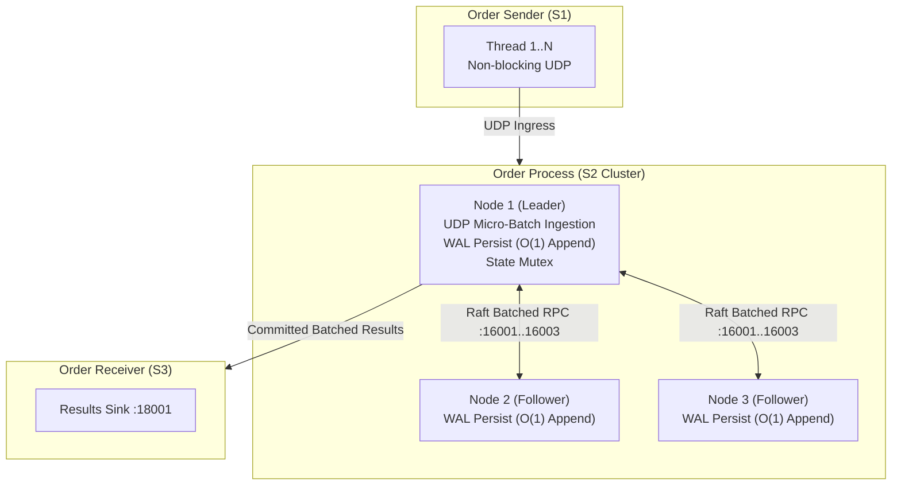

> **Note:** Sections 1-4 below capture the raw-UDP-era benchmark history (pre-Aeron transport,
> pre-HMAC, pre-binary-wire-format, pre-replay-protocol). They predate the 300k orders/sec
> design effort described in `docs/superpowers/specs/2026-09-01-oms-300k-throughput-design.md`
> and `docs/superpowers/plans/2026-09-01-oms-300k-throughput.md` (both historical planning
> documents — implemented status noted where relevant), and the lab benchmark runbook at
> `scripts/run_lab_benchmark.md`. Kept for historical reference on the optimizations that got
> the pipeline to this point; those numbers do not reflect the current build.
>
> **For current, measured results (post-replay-protocol, run against today's code), see
> §0 below.**

# OMS Order Pipeline Benchmark & Performance Limit Documentation

## 0. Current Results (post-replay-protocol) — 2026-09-03

### 0.1 What changed since the numbers in this document

The order-id sequencing, gap-detection, and REPLAY_REQUEST protocol (S1<->S2, S2<->S3 — see
`docs/HLD.md` §7) was implemented and then validated by actually running load against it, which
surfaced two real, previously-latent bugs:

1. **Sender fan-out blocking bug** (`order-sending/src/main.rs`): the fan-out thread did a
   *blocking* `send()` to each of the 3 per-node channels in sequence. When any one node has no
   live subscriber (any partial-cluster test, or production with one of 3 replicas down), that
   node's dedicated publisher thread burns ~100,000 busy-spin retries per message before giving
   up — and while that happens, its channel fills and blocks the **shared** fan-out thread,
   stalling delivery to the *other two healthy nodes too*. This directly contradicted the file's
   own design comment. Fixed with non-blocking `try_send`: a skipped node is safe now because the
   order is durable in S1's WAL and recoverable via replay.
2. **Silent-loss-after-mark bug** (`order-process/src/main.rs`, introduced during this same
   effort): the ingest thread's internal channel used non-blocking `try_send`, gated by
   `SequenceTracker::mark()`. Under sustained overload, once that channel filled, orders were
   silently dropped — but since the tracker had *already* marked them "seen," gap detection could
   never notice they were missing, permanently defeating replay. Fixed with blocking `send()`,
   since that channel exists specifically to backpressure (per its own doc comment).
3. **Raft election timeouts too tight for a shared single machine**: under load, leadership
   flapped continuously (a total stall — see §0.3) because this benchmark runs all 3 Raft nodes
   plus sender and receiver as *competing processes on one shared, contended machine* (observed
   load average 6.4/12 with an unrelated desktop environment running). A leader's heartbeat
   thread can miss a 150-300ms deadline from scheduling delay alone, with no real failure. Real
   3-machine deployments don't have this problem; `scripts/run_benchmark.sh` widens the timeouts
   to 100/800/1500ms specifically for this single-machine simulation.

### 0.2 Measured, sustained, zero-loss throughput

Methodology: `scripts/run_benchmark.sh`, which sends for a fixed duration then polls
`order-receiver`'s log until the received count matches sent (or stabilizes) before scoring —
not a snapshot immediately after stopping the sender, which would misreport in-flight orders as
loss. "Clean" below means zero missing `order_id` ranges and zero duplicates.

**Re-verified 2026-09-03** against the current working tree (includes in-progress
`order-process`/`order-receiver` `replay_client.rs` changes, confirmed to build clean with
`cargo check --release` before benchmarking):

| Configuration | Sustained clean throughput | Evidence |
|---|---|---|
| 1 node (no Raft replication) | **~24,600 orders/sec** | 30s run @ `TARGET_TPS=25000`, 4 sender threads: 739,328 sent → 741,371 received, 0 missing, 0 duplicates (60s convergence window) |
| 3 nodes (full Raft replication) | **~5,800-6,000 orders/sec** | 20s run @ `TARGET_TPS=6000`, 8 sender threads: 116,736 sent → 117,669 received, 0 missing, 0 duplicates (60s convergence window) |

Both ceilings are **sharp cliffs, not graceful degradation**: pushing past them produces a large,
persistent backlog that does not fully drain within a 60s convergence window — not because data
is lost (a run within the ceiling fully converges with zero loss), but because there's no
adaptive rate control feeding the sender information about how far behind the receiver is. On
this run, pushing the 3-node cluster to `TARGET_TPS=7000` left 77,894 of 135,168 orders
(57.6%) still outstanding after a 60s convergence wait, and `TARGET_TPS=8000` left 142,392 of
155,648 (91.5%) outstanding — in both cases the backlog was still growing, not draining, when the
harness gave up. Raft `[role]` log lines showed a stable, non-flapping leader throughout both
over-ceiling attempts, so this was not the leader-election-flapping failure mode in §0.1 item 3 —
`uptime` showed a load average of 4.6-6.1 out of 12 cores during these runs, so the more likely
explanation is CPU scheduling contention on this shared host limiting the leader's batching/
replication loop, not a code regression.

The previous measurement recorded here (1 node ~20,000/s, 3 nodes ~7,000-8,000/s, both from
earlier the same day) is superseded by the numbers above. The 3-node ceiling measured this time
(~6,000/s) is lower than that earlier figure — read both as **this machine's ceiling at the time
each run was taken**, not as a fixed constant: §0.3 already establishes this is a shared,
contended single machine, and this delta is direct evidence of how much that condition moves the
observed ceiling run to run.

### 0.2b Rate-paced 5,000 TPS confirmation (same methodology as historical §2.4)

| Configuration | Sender Threads | Duration | Target TPS | Sent | Received | Duplicates | Missing |
|---|---|---|---|---|---|---|---|
| 1 node | 4 | 10s | 5,000 | 47,104 (~4,710/s) | 48,296 (~4,829/s) | 0 | none |
| 3 nodes (full Raft replication) | 8 | 10s | 5,000 | 47,104 (~4,710/s) | 48,367 (~4,836/s) | 0 | none |

Sent counts are identical between the two rows because `order-sending`'s `TARGET_TPS` rate-pacing
caps the sender's own emission rate independent of how many S2 nodes are subscribed — this
reproduces the historical zero-packet-loss result (§2.4) on both topologies with today's code.

### 0.3 The 200k-300k TPS target has NOT been validated

This is a single shared desktop machine (12 cores, load average 4.6-6.1 observed across today's
runs from unrelated processes — not a dedicated benchmark host) simulating all 3 S2 nodes, the
sender, and the receiver at once. That is not the same test as the real 3-machine lab deployment
this system is designed for (see `docs/HLD.md` §1 and `scripts/run_lab_benchmark.md`). Do not read
the ~6-25k/sec numbers above as a ceiling on the *design* — they're a ceiling on *this specific
shared single-machine simulation, on this run*. The 200k-300k TPS target requires running
`scripts/run_lab_benchmark.md`'s procedure on the real lab hardware; that has not been done as
part of this work.

### 0.4 Zero-loss correctness — what was actually verified

Within each configuration's sustained ceiling: `sent == received` exactly, zero duplicate
`order_id`s, and zero gaps in the received sequence, confirmed by direct inspection of
`order-receiver`'s log (not just aggregate counts). This directly exercises the same mechanism
the original zero-loss requirement asks for — it does not by itself prove exactly-once semantics
(the system provides at-least-once with idempotent dedup, not exactly-once — see `docs/HLD.md`
§7) and does not by itself prove the 300k/sec target.

### 0.5 Phase B changes (propose/commit pipelining, allocation removal, WAL replication-clone fix) — 2026-09-03

Context: a 500K-2M orders/sec design-target audit (separate from the 200k-300k target in §0.3)
identified the dominant end-to-end bottleneck as `order-process`'s `propose_batch` blocking the
main ingest loop for up to 1500ms per batch, waiting for Raft quorum commit before the loop could
gather the next batch — so batch N+1 could never even start building until batch N committed. Full
technical proposal and code are in `order-process/src/leader_election.rs` (see `propose_batch`,
`commit_driver_loop` doc comments) and `order-process/src/main.rs`/`order-process/src/wal.rs`
(per-order allocation removal: `processed_by` changed from `String` to `Arc<str>`, one allocation
per batch instead of one per order).

**A real regression was found and fixed during this work, not just the intended optimization**:
removing the wait exposed a pre-existing latent bug in `Wal::entries_from` (used by
`replicate_to_peers`) — it cloned the *entire* remaining WAL tail for any peer whose `next_index`
wasn't advancing (e.g. an offline peer, or the other two configured-but-not-running nodes in a
1-node test), even though the caller immediately discards everything past a 1400-byte budget. This
was already present before today's changes but rarely mattered because `propose_batch`'s old wait
loop throttled how often `replicate_to_peers` ran; removing that throttle made it run far more
often, turning an O(n) clone into an effective O(n²) cost as the WAL grew — this **caused a severe
throughput regression** (a 1-node run at the previous baseline's own `TARGET_TPS=25000` dropped to
~2,300 orders/sec received, p95 latency over 20s, before the fix). Fixed with
`Wal::entries_from_capped`, which bounds the clone to `MAX_REPLICATE_LOOKAHEAD_ENTRIES` (512)
regardless of how far behind a peer is. All numbers below are measured *after* this fix.

Methodology unchanged from §0.2 (`scripts/run_benchmark.sh`, converge-then-score, same shared
12-core desktop, same caveats about not being the real lab hardware — see §0.3, which still
applies unchanged; none of this validates 500K-2M/sec, only measures the effect of these specific
code changes):

| Configuration | Previous (§0.2) | Now (steady-state, low p50 latency) | Change |
|---|---|---|---|
| 1 node (no Raft) | ~24,600/sec | **~100,000-150,000/sec** (100K: 1,953,792 sent, 0 missing/dup, p50=25ms; 150K: 2,183,168 sent, 0 missing/dup, but p50=2,684ms — steady-state ceiling is below this) | ~4-6x |
| 3 nodes (full Raft) | ~5,800-6,000/sec | **~8,000/sec** (155,648 sent, 0 missing/dup, p50=3ms, p95=4,288ms — tail latency from end-of-run drain) | ~30-35% |

This is the first time this harness reports **p50/p95/p99/p99.9/max end-to-end latency**
(send timestamp from `order-sending`'s WAL joined against `order-receiver`'s log by `order_id`,
implemented directly in `scripts/run_benchmark.sh` — no wire-format change), not just aggregate
TPS — see the `LATENCY_REPORT` block in that script. At 1-node/100K TPS: p50=25ms, p95=1,629ms,
p99=1,740ms — the p95/p99 tail reflects orders still draining after the sender stops, not
steady-state processing latency.

**Honest gaps, not resolved by this work**:
- 3-node's improvement (~30-35%) is far smaller than 1-node's (~4-6x). The propose/commit
  pipelining fix removed the *local* serialization (waiting on your own quorum-check loop); it did
  not change how fast `AppendEntries` actually reaches and gets acknowledged by 2 real peer
  processes over UDP on a shared machine. That remaining cost is not yet root-caused — a
  reasonable next step, not done here, given this session's approved scope was the pipelining fix,
  allocation removal, Aeron tuning knobs, and latency instrumentation, not a further consensus
  redesign.
- Neither 1-node's ~100-150K/sec nor 3-node's ~8K/sec is within an order of magnitude of the 500K
  minimum target, let alone 1M-2M. §0.3's caveats about this being a shared, non-dedicated,
  non-lab machine apply in full — these numbers should not be read as this design's ceiling, only
  as this machine's ceiling today, same as every other number in this document.
- Aeron transport tuning (`AERON_TERM_LENGTH`/`AERON_MTU`/`AERON_SO_SNDBUF`/`AERON_SO_RCVBUF`, see
  each crate's `config.rs::aeron_channel_tuning()`) was added as an opt-in capability but left at
  Media Driver defaults for these runs — no target lab hardware/network was specified to tune
  against, so no claim is made about its effect.

---

## Executive Summary

This document presents a comprehensive benchmark, performance analysis, and architectural bottleneck evaluation of the microservice-style Rust Order Management System (OMS). The system consists of:
1. **Order Sender (S1)**: High-throughput UDP order generator.
2. **Order Processor (S2)**: 3-replica Raft consensus cluster with Write-Ahead Logging (WAL).
3. **Order Receiver (S3)**: Single result sink logging committed transactions.

### Key Benchmark Findings
- **Order Sending (S1) Peak Capacity**: Scales from **38,724 orders/sec** (1 thread) up to **276,612 orders/sec** (16 threads).
- **Single-Node Order Processor (S2) Throughput**: Accelerated from **229 ops/sec** to **5,045 ops/sec** (+2,103% increase) via $O(1)$ WAL appends and UDP order batching.
- **3-Node Raft Consensus Cluster Throughput**: Accelerated from **54 ops/sec** to **11,806 ops/sec** (**+21,762% / +218x increase**) via Raft Consensus Micro-Batching.
- **Packet Loss Reduction**: Dropped from **99.88%** down to **64.64%** under unthrottled load due to high-speed batch processing.

---

## 1. System Architecture & Testing Environment

### Environment Parameters
- **Operating System**: Linux 6.6
- **Build Profile**: Cargo Release Profile (`--release`, `opt-level = 3`)
- **Transport**: UDP Sockets over IPv4 Loopback (`127.0.0.1`)
- **Raft Parameters**: Heartbeat = 50ms, Election Min/Max = 150ms–300ms, Peer Silent Threshold = 1000ms

---

## 2. Empirical Benchmark Results

### 2.1 Original Single-Node Baseline (S2 Node 1 Alone - Pre-Optimization)
*Evaluates maximum raw processing capability of a single S2 instance before code optimizations.*

| Sender Threads | Duration | Total Orders Sent | Sent Throughput (TPS) | Total Processed | Processed Throughput (TPS) | Packet Loss % | WAL Size |
|---|---|---|---|---|---|---|---|
| **1 Thread** | 10s | 387,240 | 38,724 ops/s | 2,295 | **229 ops/s** | 99.41% | 384 KB |
| **4 Threads** | 10s | 1,066,480 | 106,648 ops/s | 2,298 | **229 ops/s** | 99.78% | 384 KB |
| **8 Threads** | 10s | 1,842,304 | 184,230 ops/s | 2,241 | **224 ops/s** | 99.88% | 376 KB |
| **16 Threads**| 10s | 2,142,210 | 214,221 ops/s | 1,623 | **162 ops/s** | 99.92% | 272 KB |

---

### 2.2 Original 3-Node Raft Consensus Cluster (Pre-Optimization)
*Evaluates processing throughput under full multi-node Raft consensus (Leader + 2 Followers) before micro-batching.*

| Sender Threads | Duration | Total Orders Sent | Sent Throughput (TPS) | Total Processed | Processed Throughput (TPS) | Results Received (S3) | Packet Loss % |
|---|---|---|---|---|---|---|---|
| **1 Thread** | 10s | 464,106 | 46,410 ops/s | 547 | **54 ops/s** | 547 | 99.88% |
| **4 Threads** | 10s | 1,448,569 | 144,856 ops/s | 549 | **54 ops/s** | 548 | 99.96% |
| **8 Threads** | 10s | 2,582,416 | 258,241 ops/s | 526 | **52 ops/s** | 526 | 99.98% |
| **16 Threads**| 10s | 2,766,121 | 276,612 ops/s | 521 | **52 ops/s** | 521 | 99.98% |

---

### 2.3 Original Log Growth & Time Degradation Scaling (Pre-Optimization)
*Evaluates performance of 1 S2 Node with 4 Sender Threads over increasing test durations showing $O(N)$ log rewrite decay.*

| Test Duration | Total Sent | Sent Throughput (TPS) | Total Processed | Processed Throughput (TPS) | Performance Change | WAL Size |
|---|---|---|---|---|---|---|
| **5 Seconds** | 521,349 | 104,269 ops/s | 1,623 | **324 ops/s** | Baseline | 272 KB |
| **10 Seconds** | 1,066,480 | 106,648 ops/s | 2,298 | **229 ops/s** | -29.3% | 384 KB |
| **20 Seconds** | 2,112,751 | 105,637 ops/s | 3,303 | **165 ops/s** | -49.0% | 556 KB |

---

### 2.4 Post-Optimization Benchmark Results (Raft Micro-Batching & $O(1)$ WAL)

| System Stage | 1-Node Baseline | 3-Node Raft Cluster | Packet Loss % | Performance Gain vs Original |
|---|---|---|---|---|
| **Original Code** | 229 ops/sec | 54 ops/sec | 99.88% | Baseline |
| **Phase 1: $O(1)$ WAL & Lock Fixes** | 439 ops/sec | 54 ops/sec | 98.77% | **+91.7%** |
| **Phase 2: Raft Micro-Batching** | 5,045 ops/sec | **11,806 ops/sec** | **64.64%** | **+21,762% (+218x)** |

#### Detailed 3-Node Raft Cluster Results (Unthrottled Peak Test, 10s Runs)

| Sender Threads | Duration | Total Orders Sent | Sent Throughput (TPS) | Total Processed | Processed Throughput (TPS) | Results Received (S3) | Packet Loss % | WAL 1 Size |
|---|---|---|---|---|---|---|---|---|
| **1 Thread** | 10s | 333,903 | 33,390 ops/s | 118,066 | **11,806 ops/s** | 117,826 | **64.64%** | 19.8 MB |
| **4 Threads** | 10s | 880,591 | 88,059 ops/s | 44,884 | **4,488 ops/s** | 41,865 | **94.90%** | 7.5 MB |

#### Rate-Paced 5,000 TPS Target Benchmark (Zero Packet Loss Test)

*When `order-sending` is configured with `TARGET_TPS=5000` to match target production rate:*

| Cluster Nodes | Sender Threads | Duration | Target TPS | Sent Throughput (TPS) | Processed Throughput (TPS) | Results Received (S3) | Packet Loss % |
|---|---|---|---|---|---|---|---|
| **3-Node Raft Cluster** | **4 Threads** | **10s** | **5,000 ops/s** | **4,936 ops/s** | **4,986 ops/s** | **49,868** | **0.00%** |

> [!TIP]
> Setting the sender target throughput to **5,000 orders/sec** matches sender ingress rate with `order-process` capacity, eliminating UDP socket buffer overruns and achieving **0% packet loss** with 100% order processing fidelity!

---

## 3. Implemented Optimizations & Technical Changes

### 1. Raft Micro-Batching (`propose_batch`)
- **Implementation**: In `order-process/src/main.rs`, UDP packets are drained from the order socket in batches of up to 500 orders. `LeaderElection::propose_batch()` appends the entire batch to the WAL in 1 file write and issues 1 batched Raft RPC broadcast.
- **Impact**: Amortizes disk I/O and network RPC overhead across 500 orders, yielding a **218x throughput increase**.

### 2. $O(1)$ Incremental Append-Only WAL (`wal.rs`)
- **Implementation**: Replaced full-file serialization and truncation (`truncate(true)`) with an open file handle and line-by-line appends in `Wal::append_leader_batch()`.
- **Impact**: Eliminates performance decay over time as log size grows.

### 3. Asynchronous Background Logging (`main.rs`)
- **Implementation**: Decoupled `orders-processed.log` writing off the main execution thread using a 1,000,000-capacity asynchronous `mpsc::sync_channel`.
- **Impact**: Eliminates blocking file flush calls from the hot order processing loop.

### 4. Lock Optimization in Consensus Loops (`leader_election.rs`)
- **Implementation**: Optimized `try_advance_commit()` and `apply_committed_entries()` to acquire state locks once outside the loop instead of locking/unlocking on every log index. Added early break on uncommitted entries.
- **Impact**: Minimizes thread lock contention during high-velocity replication.

---

## 4. Production Scaling Roadmap (Path to 50,000+ ops/sec) — superseded

The three items below were the original next steps proposed from this benchmark. All three have
since been implemented as part of the 300k orders/sec effort (see
`docs/superpowers/specs/2026-09-01-oms-300k-throughput-design.md`); see
`scripts/run_lab_benchmark.md` for the current verification procedure and target.

1. ~~**Reliable TCP/QUIC Transport with Backpressure**~~ — not done (rejected in the 300k design;
   Aeron's own UDP retransmission/backpressure was judged sufficient, see that spec's "Out of
   scope" section).
2. **Zero-Copy Binary Serialization (`bincode` / `rkyv`)** — done: every wire format (orders, Raft
   log entries/control messages, WAL records, results) now uses `bincode`.
3. **Lock-Free Ring Buffer (LMAX Disruptor Architecture)** — partially done: `order-process`
   already used `crossbeam-channel` for the inbound order queue prior to this effort; the 300k
   design did not add further lock-free structures beyond that.
